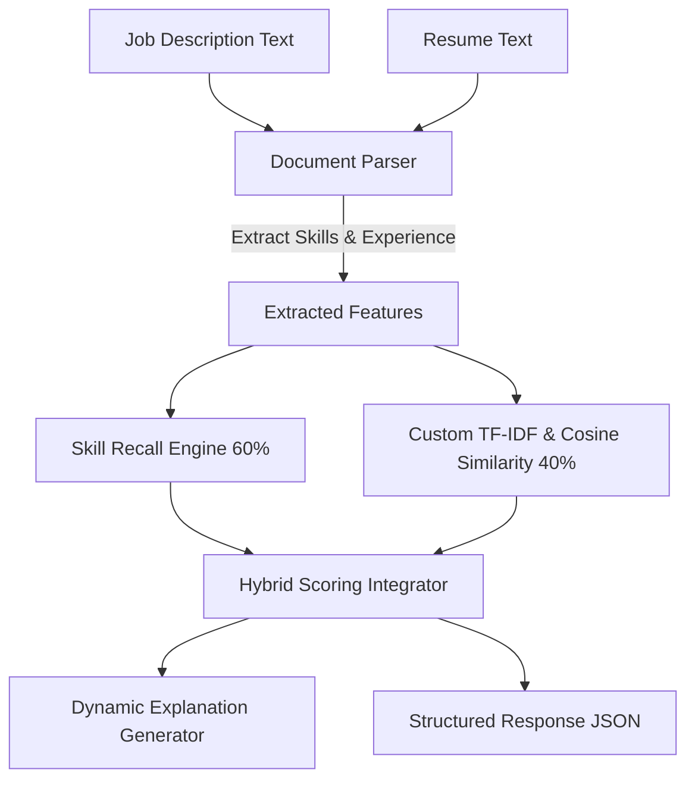

# 🤖 Smart Resume Screening System (AI-Powered)

<p align="center">
  
  
  
  
</p>

An advanced, offline-first, AI-powered resume screening system built with **FastAPI**. It leverages a high-performance **hybrid matching algorithm** (incorporating a custom TF-IDF vectorizer + skill recall analyzer) to automatically parse, compare, and score candidates against job descriptions.

---

## 🌟 Key Features

*   **Offline Hybrid Engine**: Blends contextual **TF-IDF Cosine Similarity** (40%) with explicit **Skill Recall Matching** (60%) to score resumes accurately without relying on heavy ML libraries or external network API calls.
*   **Highly Curated Skills Database**: Houses **170+ tech and soft skills** categorized across 13 domains (Frontend, Backend, Cloud, DevOps, ML/AI, Security, Mobile, etc.) for robust two-pass parsing.
*   **Precise Parser**: Avoids false positives (e.g., matching the programming language "R" inside the word "React") by utilizing strict word-boundary checks and multi-word substring priority searches.
*   **Structured AI Explanations**: Generates readable 2–3 line summaries for every candidate details match percentages, detected experience, and overall alignment.
*   **Developer Friendly**: Offers fully validated Pydantic v2 schemas and auto-generated Swagger interactive documentation at `/docs`.

---

## 🧠 System Architecture



---

## 📦 Tech Stack

*   **Core API Framework**: FastAPI (v0.110+)
*   **ASGI Web Server**: Uvicorn (v0.29+)
*   **Data Validation**: Pydantic (v2.0+)
*   **Mathematical Operations**: Standard `math`, `re`, and `collections` library (Zero external ML library dependencies for 100% portability)

---

## 🚀 Setup & Installation

Follow these quick commands to spin up the system in a virtual environment:

### 1. Clone & Navigate
```bash
git clone https://github.com/Prabhat12112002/Resume-Screener.git
cd Resume-Screener
```

### 2. Configure Environment
```bash
# Create virtual environment
python -m venv venv

# Activate virtual environment
# On Windows (PowerShell):
.\venv\Scripts\activate
# On macOS/Linux:
source venv/bin/activate
```

### 3. Install Dependencies
```bash
pip install -r requirements.txt
```

---

## ▶️ Running the API

Start the local server with hot-reload enabled:

```bash
uvicorn app.main:app --reload
```

Once running, access the services:
*   **Interactive Swagger Docs**: 🌐 [http://localhost:8000/docs](http://localhost:8000/docs)
*   **Alternative API Docs (ReDoc)**: 🌐 [http://localhost:8000/redoc](http://localhost:8000/redoc)
*   **API Root / Health Check**: 🌐 [http://localhost:8000/](http://localhost:8000/)

---

## 📡 API Usage Guide

### Screening Endpoint
*   **Endpoint**: `/screen-resumes`
*   **Method**: `POST`
*   **Payload**: `application/json`

#### Request Payload Structure
```json
{
  "job_description": "Looking for a Python backend engineer with FastAPI, PostgreSQL, and Docker experience. Strong knowledge of REST API architecture and Git is expected.",
  "resumes": [
    {
      "name": "Backend_John",
      "text": "Senior Developer. Specialized in Python, Django, FastAPI, and PostgreSQL. Deployed containers using Docker. Version control with Git."
    },
    {
      "name": "Frontend_Sarah",
      "text": "Frontend designer working with React, HTML, CSS, Tailwind CSS, JavaScript, and Figma."
    }
  ]
}
```

#### Sample Response (HTTP 200)
```json
{
  "total_resumes": 2,
  "results": [
    {
      "name": "Backend_John",
      "match_score": 60,
      "matched_skills": [
        "docker",
        "fastapi",
        "git",
        "postgresql",
        "python",
        "rest"
      ],
      "missing_skills": [],
      "explanation": "Good match with some skill gaps. The candidate matches 6 out of 6 identified skills (100% skill overlap). The resume indicates approximately 5 years of experience."
    },
    {
      "name": "Frontend_Sarah",
      "match_score": 6,
      "matched_skills": [],
      "missing_skills": [
        "docker",
        "fastapi",
        "git",
        "postgresql",
        "python"
      ],
      "explanation": "Poor match — the candidate's profile does not align well with this role. The candidate matches 0 out of 5 identified skills (0% skill overlap)."
    }
  ]
}
```

---

## 📁 Repository Structure

```
Resume-Screener/
├── app/
│   ├── __init__.py          # Package initializer
│   ├── main.py              # FastAPI app setup and routes
│   ├── parser.py            # Custom skill & experience extractor
│   ├── matcher.py           # Custom TF-IDF engine & similarity functions
│   ├── models.py            # Pydantic schema validation structures
│   └── skills_db.py         # 170+ Curated technology vocabulary dictionary
├── sample_resumes/          # Test profiles (Backend, Frontend, Data Science)
│   ├── resume_backend.txt
│   ├── resume_frontend.txt
│   └── resume_datascience.txt
├── requirements.txt         # Core packages list
├── README.md                # Premium documentation (this file)
└── .gitignore               # Ignored version control patterns
```

---

## 📜 License

This project is open-source and licensed under the [MIT License](LICENSE).
