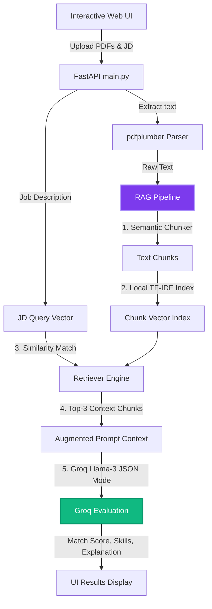

# 🤖 Smart Resume Screening System (AI-Powered)

<p align="center">
  
  
  
  
  
</p>

An advanced, offline-first, AI-powered resume screening system built with **FastAPI**. It leverages a high-performance **RAG (Retrieval-Augmented Generation) pipeline** combining a custom local TF-IDF vector index and **Groq Llama 3** to automatically parse PDF resumes, match them against job descriptions, and deliver structured scores, missing skills, and dynamic recruiter feedback.

---

## 🌟 Key Features

*   **Premium Web UI**: Beautiful dark mode and glassmorphism interface served directly from the FastAPI root (`/`), featuring an interactive file dropzone and animated matching results.
*   **pdfplumber Parser**: Extracts text cleanly from multi-page PDF resumes.
*   **Custom RAG Pipeline**: Splits long resumes into semantic chunks and indexes them locally using an in-memory TF-IDF vectorizer. It retrieves the top 3 most relevant segments matching the Job Description to feed as precise context to the LLM.
*   **Groq API Integration**: Employs Groq's `llama3-8b-8192` model in strict JSON Mode to produce highly objective scores and recruiter feedback.
*   **Local Fallback Engine**: Seamlessly falls back to our local hybrid scoring algorithm (60% skill recall + 40% contextual TF-IDF cosine similarity) if the Groq API key is not configured or if there is no internet access.
*   **Robust Vocab Dictionary**: Curated database of **170+ tech and soft skills** spanning 13 domains to ensure strict word-boundary matching.

---

## 🧠 System & RAG Architecture



---

## 📦 Tech Stack

*   **Core Framework**: FastAPI (v0.110+) & Uvicorn (v0.29+)
*   **PDF Extraction**: pdfplumber (v0.11+)
*   **LLM API**: Groq SDK (v1.5.0+)
*   **Data Validation & Env**: Pydantic (v2.0+) & python-dotenv
*   **Vector Engine**: Custom Python-stdlib math matrices (Zero external ML library dependencies)

---

## 🚀 Setup & Installation

### 1. Clone & Navigate
```bash
git clone https://github.com/Prabhat12112002/Resume-Screener.git
cd Resume-Screener
```

### 2. Configure Environment
```bash
# Create virtual environment
python -m venv venv

# Activate virtual environment
# Windows (PowerShell):
.\venv\Scripts\activate
# macOS/Linux:
source venv/bin/activate
```

### 3. Install Dependencies
```bash
pip install -r requirements.txt
```

### 4. Set Up API Keys
Create a `.env` file in the root directory (or rename `.env.example`):
```env
GROQ_API_KEY=gsk_your_key_here
```
> [!TIP]
> Get a free API key at [console.groq.com](https://console.groq.com). If the key is left empty, the application will run locally using the offline fallback engine.

---

## ▶️ Running the Application

Start the FastAPI server:

```bash
uvicorn app.main:app --reload
```

Once running, access the services:
*   **Interactive Web UI**: 🌐 [http://localhost:8000/](http://localhost:8000/)
*   **Interactive API Docs**: 🌐 [http://localhost:8000/docs](http://localhost:8000/docs)

---

## 📡 API Usage Guide

### Screening Endpoint
*   **Endpoint**: `/screen-resumes`
*   **Method**: `POST`
*   **Payload**: `multipart/form-data`

| Parameter | Type | Description |
|-----------|------|-------------|
| `job_description` | `string` (Form Field) | The job requirements text |
| `resumes` | `file[]` (Upload files) | Array of PDF/TXT resumes |

#### Example using curl
```bash
curl -X POST http://localhost:8000/screen-resumes \
  -F "job_description=Python backend developer with FastAPI, PostgreSQL, and Docker." \
  -F "resumes=@resume1.pdf" \
  -F "resumes=@resume2.pdf"
```

#### Sample Response (HTTP 200)
```json
{
  "total_resumes": 2,
  "results": [
    {
      "name": "resume1.pdf",
      "match_score": 85,
      "matched_skills": ["docker", "fastapi", "postgresql", "python"],
      "missing_skills": ["kubernetes"],
      "explanation": "Strong candidate with direct FastAPI and PostgreSQL experience. Missing Kubernetes but has solid Docker foundation."
    }
  ]
}
```

---

## 📁 Repository Structure

```
Resume-Screener/
├── app/
│   ├── __init__.py          # Package initializer
│   ├── main.py              # FastAPI app and static directory routing
│   ├── parser.py            # pdfplumber text extraction + local parser
│   ├── matcher.py           # Custom local TF-IDF matrices (fallback engine)
│   ├── rag_pipeline.py      # Custom text chunker, local vector index, and retriever
│   ├── groq_client.py       # Groq API Llama 3 interface (JSON Mode)
│   ├── models.py            # Pydantic schema validation structures
│   ├── skills_db.py         # 170+ Curated technology vocabulary dictionary
│   └── static/              # Glassmorphic UI frontend files
│       ├── index.html
│       ├── style.css
│       └── script.js
├── requirements.txt         # Core packages list
├── README.md                # This file
├── .env.example             # Environment template
└── .gitignore               # Ignored version control patterns
```

---

## 📜 License

This project is open-source and licensed under the [MIT License](LICENSE).
